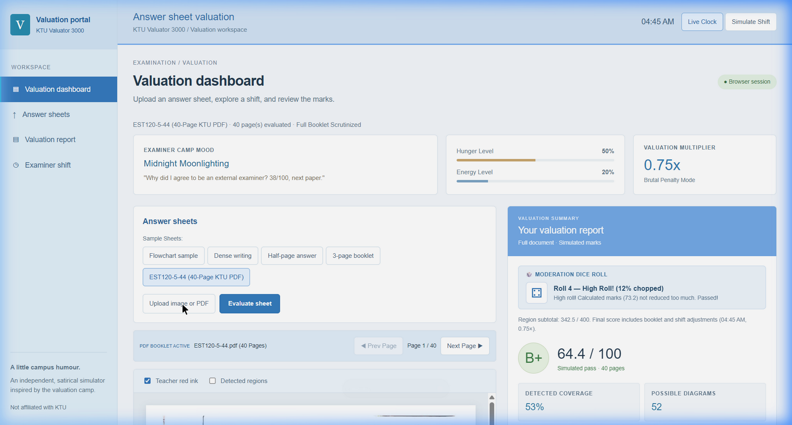
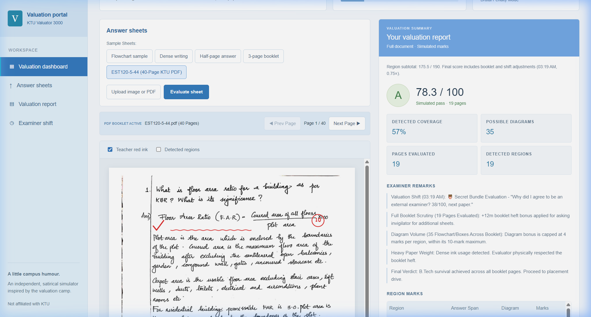
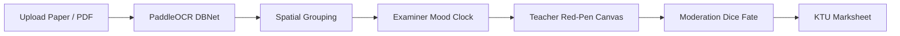

# KTU Valuator 3000 🎯

## Basic Details
### Team Name: Supply Shenanigans

### Team Members
- Team Lead: Akshay Kumar A
- Member: Anoob B

### Project Description
A satirical, in-browser answer sheet evaluation software inspired by Kerala KTU valuation memes. Instead of reading handwritten answers, it evaluates papers based on physical ink volume, answer vertical height, flowchart/box presence, and most importantly: the **exact time of evaluation** (pre-lunch hangry hour vs post-chaya nirvana).

### The Problem (that doesn't exist)
KTU engineering professors spend countless hours agonizing over whether students actually answered the question or just drew a recursive system architecture diagram with 5 arrows and wrote lyrics in cursive.

### The Solution (that nobody asked for)
An automated in-browser AI valuation cell powered by PaddleOCR DBNet (ONNX WASM) that ignores semantic words entirely and scores papers using authentic university valuation lore:
- **Vertical Span Metric**: The longer the answer, the higher the marks.
- **Diagram Multiplier**: Any box with arrows gets +3.5 marks automatically.
- **Time-of-Valuation Mood Engine**:
  - **12:30 PM (Pre-Lunch Hangry Hour)**: -25% penalty, 38/100 failure syndrome.
  - **11:15 AM (Post-Chaya Nirvana)**: Chaya & Parippuvada high, +10 marks to everyone!
  - **02:45 PM (Post-Lunch Food Coma)**: Flat 52/100 to everyone without looking.
  - **04:50 PM (KSRTC Bus Rush)**: 5-second grading purely by diagram count.

## Technical Details
### Technologies/Components Used
For Software:
- Languages: JavaScript (ES Modules), HTML5 Canvas, CSS3
- Frameworks/Tools: Vite
- Machine Learning Engine: `onnxruntime-web` (PaddleOCR DBNet Mobile `ch_PP-OCRv3_det` in WebAssembly)
- Image Processing: Canvas API, Adaptive Thresholding, Connected-Component Bounding Box Extraction

### Implementation
For Software:
# Installation
```bash
npm install
```

# Run
```bash
npm run dev
```


### Project Documentation
For Software:

# Screenshots

*Valuation Dashboard: Full KTU answer booklet scrutiny with live examiner mood tracker, moderation dice roll, and final grade marksheet.*


*Teacher Red-Pen Mode: Automated satirical annotations (checkmarks, squiggles, and circled question scores) on student handwritten answer sheets.*


# Diagrams



## Team Contributions
- Akshay Kumar A: Full-stack architecture, ONNX DBNet text-region detection integration, satirical valuation scoring algorithms, examiner shift/mood simulation, HTML5 canvas red-pen annotation engine, and tabbed valuation portal.
- Anoob B: KTU multi-page answer booklet testing, valuation rules validation, sample answer sheet curation, and edge-case testing.

### Valuation Workspace
The interface uses ktu theme. Upload an image or PDF, toggle region outlines and marks, and navigate PDF pages to review the complete booklet report.

Question markers are estimated from compact shapes in the left margin with nearby answer content. Without markers, large whitespace gaps separate regions. Detached headers are excluded when a first answer marker is found. The satirical scoring, shift multiplier rules, and moderation dice mechanics are fully simulated in-browser.

---
Made with ❤️ at TinkerHub Useless Projects 


